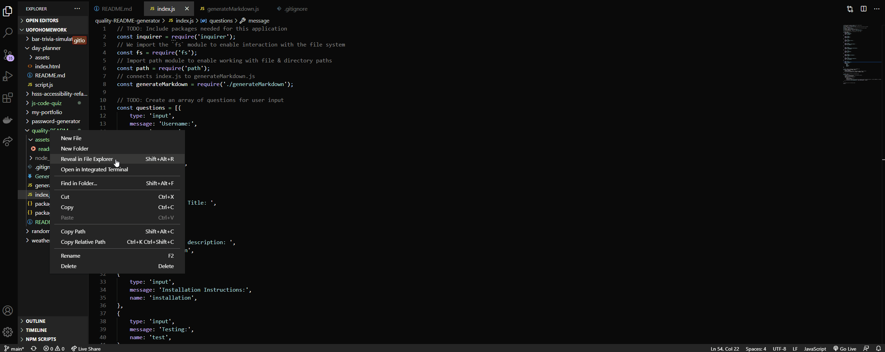

# quality-README-generator
- This app gives the user a series of README related prompts to answer including username, email, description, installation instructions, usage information, contribution guidelines, and test instructions. Each answer is logged and a quality README.md is generated.

## Table of contents
- [General Info](#general-info)
- [Installation](#installation)
- [Usage](#usage)
- [Link to GitHub Repo](#link-to-github-repo)
- [Demo](#demo)
- [Technologies](#technologies)
- [Summary](#summary)
- [Author](#author)

## General Info
-This application meets the following criteria:

```
GIVEN a command-line application that accepts user input
WHEN I am prompted for information about my application repository
THEN a high-quality, professional README.md is generated with the title of my project and sections entitled Description, Table of Contents, Installation, Usage, License, Contributing, Tests, and Questions
WHEN I enter my project title
THEN this is displayed as the title of the README
WHEN I enter a description, installation instructions, usage information, contribution guidelines, and test instructions
THEN this information is added to the sections of the README entitled Description, Installation, Usage, Contributing, and Tests
WHEN I choose a license for my application from a list of options
THEN a badge for that license is added near the top of the README and a notice is added to the section of the README entitled License that explains which license the application is covered under
WHEN I enter my GitHub username
THEN this is added to the section of the README entitled Questions, with a link to my GitHub profile
WHEN I enter my email address
THEN this is added to the section of the README entitled Questions, with instructions on how to reach me with additional questions
WHEN I click on the links in the Table of Contents
THEN I am taken to the corresponding section of the README
```

## Installation
```md
Open file in integrated terminal
npm init 
You will need to install inquirer
npm install inquirer
```
## Usage
To run this app enter the following into an integrated terminal:
```
node index
```

## Link to GitHub Repo
- https://github.com/joshrehanek/quality-README-generator

## Demo
- 

## Technologies
- [node.js](https://nodejs.org/en//)

## Summary

- This app gives the user a series of README related prompts to answer including username, email, description, installation instructions, usage information, contribution guidelines, and test instructions. Each answer is logged and a quality README.md is generated.


## Author
-Joshua Azzam Rehanek